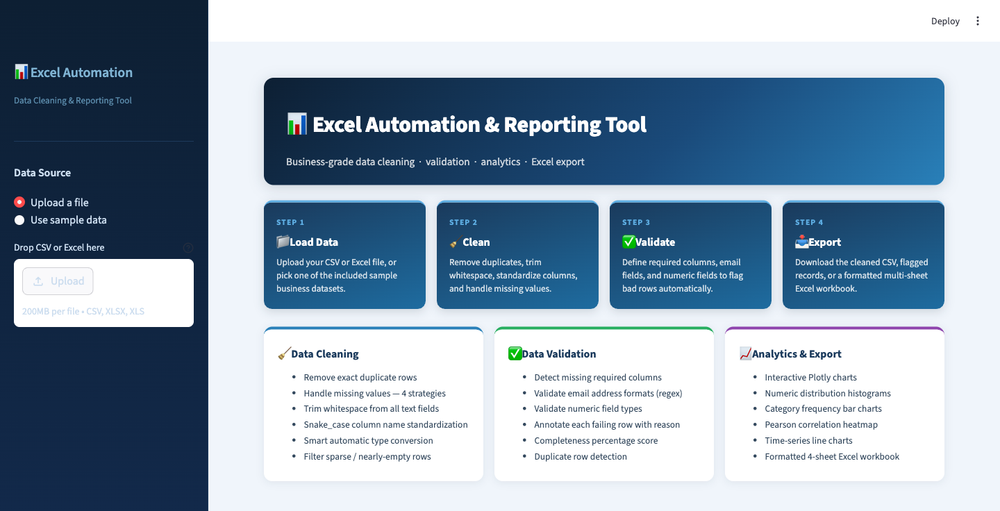
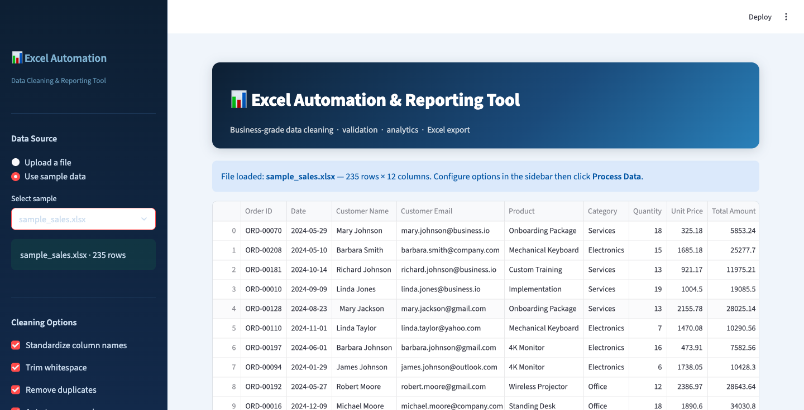
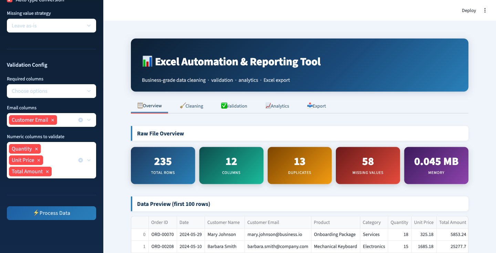
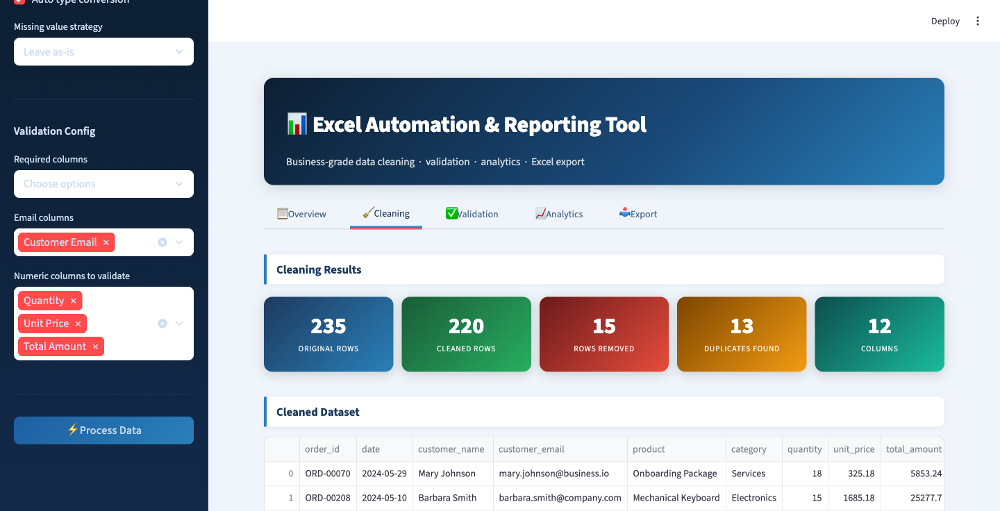
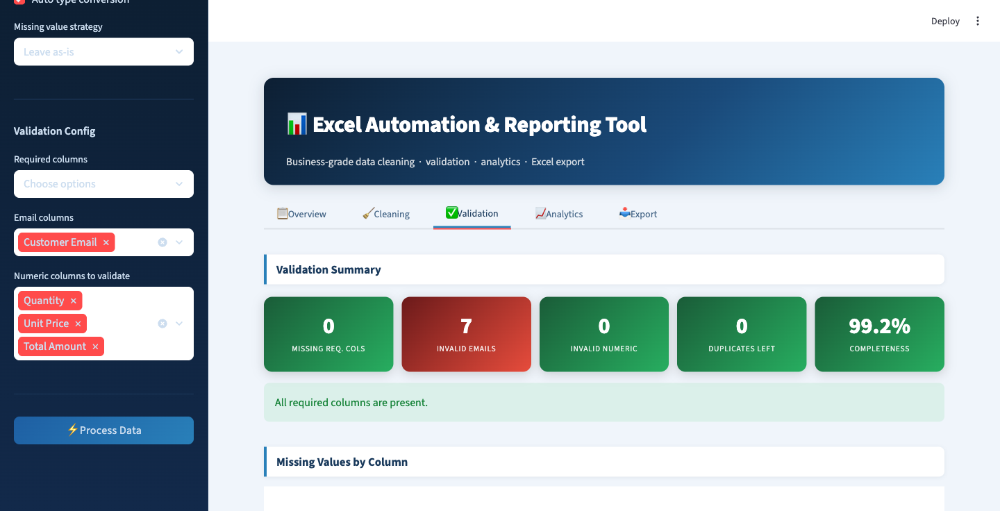
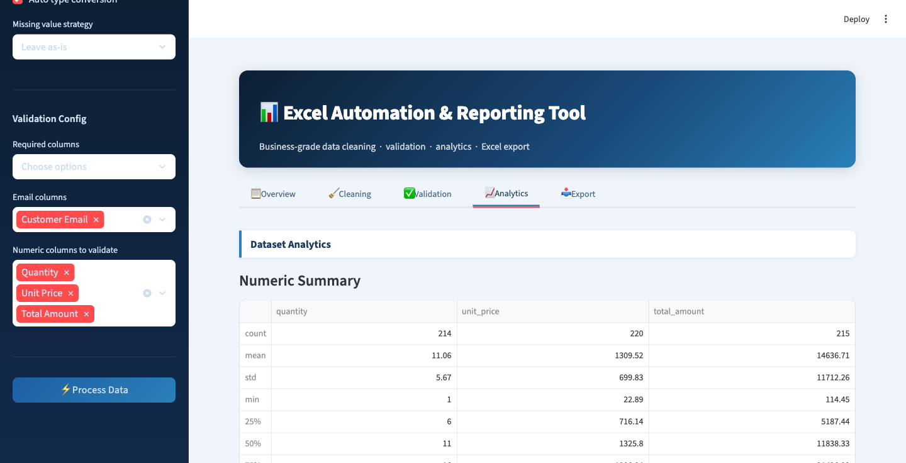
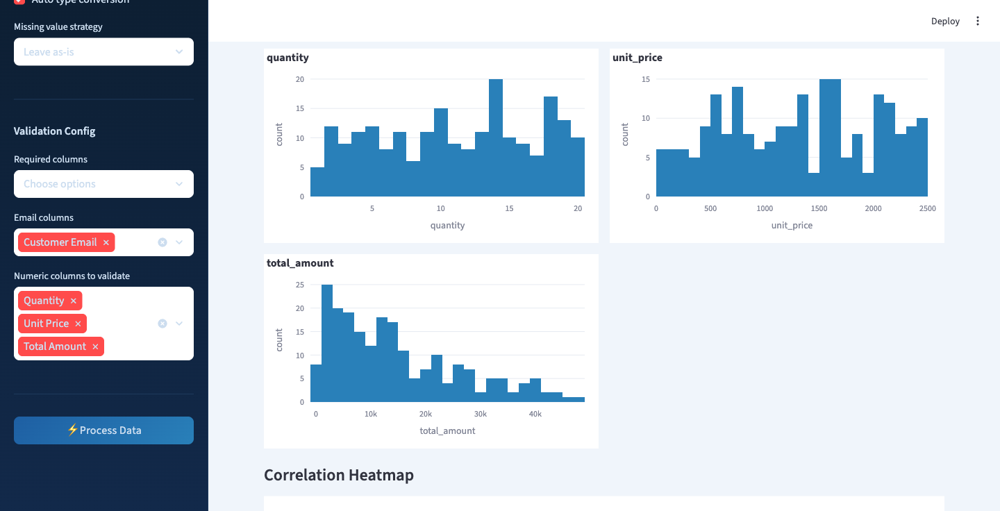
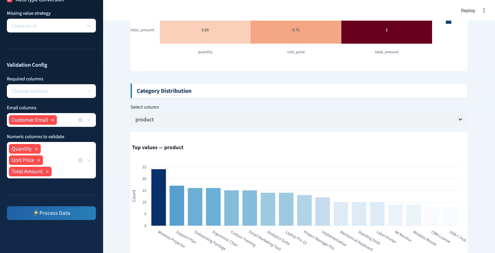
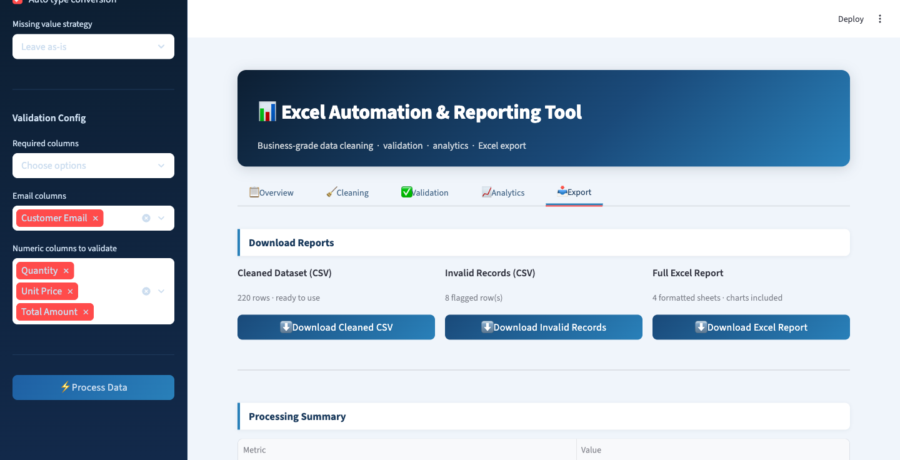

# 📊 Excel Automation & Reporting Tool

A production-grade Python application for automated data cleaning, validation, analytics, and Excel report generation — built for freelancing, portfolio, and resume use.

[](https://python.org)
[](https://streamlit.io)
[](https://pandas.pydata.org)
[](LICENSE)

---

## Overview

This tool accepts CSV and Excel files, runs a configurable cleaning pipeline, validates data against user-defined rules, generates analytics, and exports a formatted multi-sheet Excel workbook — all through a clean Streamlit dashboard.

**Practical use cases:**
- Cleaning raw CRM exports before import
- Validating vendor-supplied data files
- Generating monthly sales summary reports
- Automating repetitive Excel work for clients

---

## Features

| Category | Capability |
|---|---|
| **Upload** | CSV, XLSX, XLS · multiple sample datasets |
| **Cleaning** | Deduplication · whitespace trim · column name standardization · auto type conversion · 4 missing-value strategies |
| **Validation** | Required column check · email format regex · numeric field validation · per-row issue annotation |
| **Analytics** | Numeric describe · histograms · category bar charts · correlation heatmap · time-series line chart |
| **Export** | Cleaned CSV · invalid records CSV · formatted 4-sheet Excel workbook with embedded chart |
| **Logging** | Structured logs written to `exports/logs/YYYY-MM-DD.log` |

---

## Architecture

```
excel-automation-tool/
│
├── main.py                       # Streamlit dashboard (entry point)
│
├── automation/
│   ├── cleaner.py                # DataCleaner — composable 6-step cleaning pipeline
│   └── validator.py              # DataValidator — email, numeric & column rules
│
├── reports/
│   └── excel_exporter.py         # ExcelExporter — formatted 4-sheet workbook builder
│
├── utils/
│   ├── helpers.py                # Analytics computation, formatting, name mapping
│   └── logger.py                 # Centralized daily-file logging setup
│
├── data/
│   ├── sample_sales.xlsx         # 235-row sales dataset with injected dirty data
│   ├── sample_sales.csv          # CSV version of the same dataset
│   ├── sample_customers.xlsx     # 168-row customer dataset with injected dirty data
│   ├── sample_customers.csv      # CSV version of the same dataset
│   └── generate_sample_data.py   # Bootstrap script — re-run to regenerate all files
│
├── docs/
│   └── screenshots/              # App screenshots used in this README
│
├── exports/
│   └── logs/                     # Auto-created daily log files (gitignored)
│
├── requirements.txt
├── .gitignore
└── README.md
```

---

## Local Setup

### 1. Clone the repository

```bash
git clone https://github.com/your-username/excel-automation-tool.git
cd excel-automation-tool
```

### 2. Create a virtual environment

```bash
python -m venv venv
source venv/bin/activate        # macOS / Linux
venv\Scripts\activate           # Windows
```

### 3. Install dependencies

```bash
pip install -r requirements.txt
```

### 4. Generate sample data

```bash
python data/generate_sample_data.py
```

### 5. Launch the dashboard

```bash
streamlit run main.py
```

Open [http://localhost:8501](http://localhost:8501) in your browser.

---

## Usage Walkthrough

1. **Select data source** — upload your own file or pick a sample from the sidebar.
2. **Configure cleaning** — choose which steps to apply (dedup, trim, type conversion, missing-value strategy).
3. **Set validation rules** — mark required columns, email fields, and numeric fields.
4. **Click Process Data** — results appear across five tabs.
5. **Download reports** — grab the cleaned CSV, invalid records CSV, or the full formatted Excel workbook.

---

## Dashboard Tabs

| Tab | Contents |
|---|---|
| **Overview** | KPIs · raw data preview · column profile table |
| **Cleaning** | Before/after metrics · cleaned data preview · processing log |
| **Validation** | Missing column alerts · missing-value bar chart · invalid row table |
| **Analytics** | Numeric distributions · category charts · correlation heatmap · time-series |
| **Export** | Download buttons · processing summary |

---

## Deployment — Streamlit Community Cloud

1. Push the repository to GitHub (ensure `requirements.txt` is at the root).
2. Visit [share.streamlit.io](https://share.streamlit.io) and connect your GitHub account.
3. Select the repository, set **Main file path** to `main.py`, and deploy.

> **Note:** The `data/` folder must contain the sample `.xlsx` and `.csv` files. Run `python data/generate_sample_data.py` locally, commit the generated files, and push before deploying.

---

## Tech Stack

| Tool | Purpose |
|---|---|
| **Python 3.9+** | Core language |
| **pandas** | Data manipulation and analysis |
| **openpyxl** | Excel workbook generation and styling |
| **Streamlit** | Interactive web dashboard |
| **Plotly** | Interactive charts |
| **NumPy** | Numeric operations |

---

## Screenshots

### Landing Page


### Sidebar — Excel File Loaded


### Overview Tab — KPIs & Data Preview


### Cleaning Tab — Results


### Validation Tab — Summary


### Analytics — Numeric Summary


### Analytics — Distribution Charts


### Analytics — Correlation Heatmap & Category Chart


### Export Tab — Download Panel


---

## Live Demo

[Open the Excel Automation Tool](https://excel-automation-azarsyed.streamlit.app)

Hosted on Streamlit Community Cloud. Upload your own CSV or XLSX, or
use the packaged sample datasets, to see the full clean → validate →
analyse → export pipeline in one click.

---

## Extending the Tool

- **Email report sending** — add `smtplib` integration to `reports/` and trigger after export.
- **SQLite history** — log every processing run to a local database via `sqlite3`.
- **Configurable rules** — load validation config from a JSON file instead of the sidebar.
- **Scheduled runs** — wrap `main.py` logic in a script and schedule with `cron` or `APScheduler`.

---

## License

MIT — free to use in commercial projects and client work.
